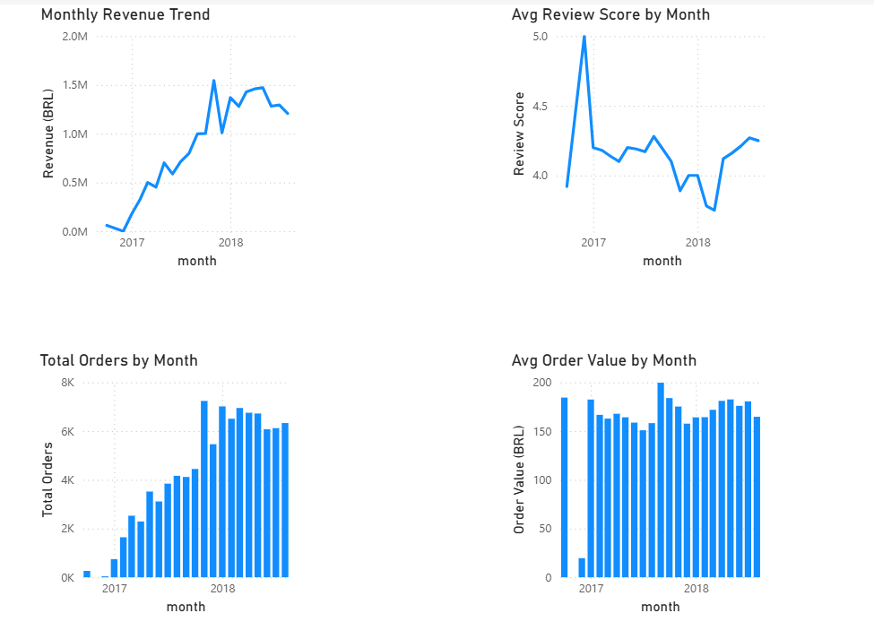
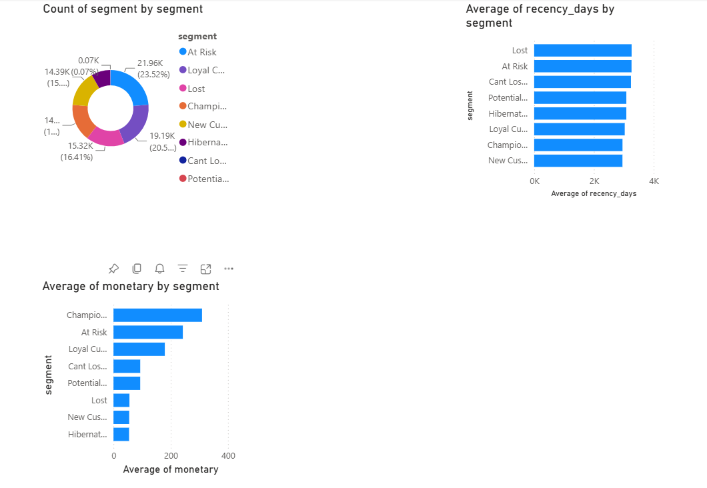
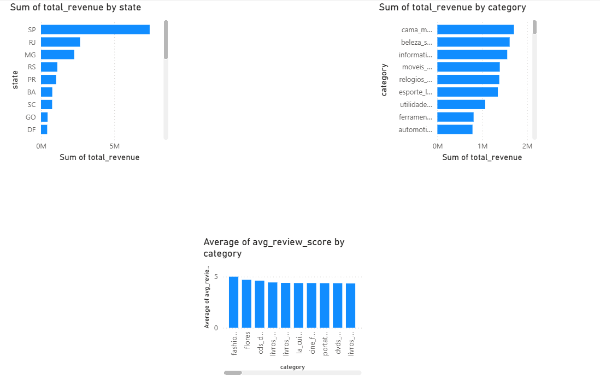
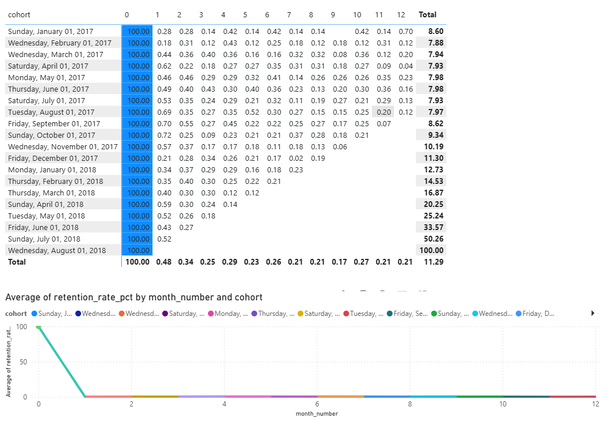

# Sales-Analytics-Dashboard
End-to-end retail analytics project analyzing 100K+ orders using PostgreSQL (RFM segmentation, cohort retention, sales trends) and visualized in Power BI.
# Retail Sales & Customer Segmentation Analysis

## Project Overview
End-to-end data analytics project analyzing 100,000+ orders from the 
Olist Brazilian E-Commerce dataset using PostgreSQL and Power BI.

## Business Questions Answered
- Which customer segments generate the most revenue?
- What are the monthly sales trends by region and category?
- What is the customer retention rate over time?
- What are the key monthly KPIs for the business?

## Dataset
- Source: [Olist Brazilian E-Commerce](https://www.kaggle.com/datasets/olistbr/brazilian-ecommerce)
- Size: 100K+ orders, 99K+ customers, 112K+ order items
- Tables: 7 (orders, customers, products, sellers, payments, reviews, order items)

## Tools Used
- **Database:** PostgreSQL (pgAdmin)
- **Analysis:** SQL (CTEs, Window Functions, Aggregations, Views)
- **Visualization:** Microsoft Power BI

## Project Structure
├── schema.sql                  # Database schema (7 tables)
├── rfm_segmentation.sql        # RFM customer segmentation
├── sales_trend_analysis.sql    # Sales by month, region, category
├── cohort_analysis.sql         # Customer retention cohort analysis
├── kpi_views.sql               # Power BI ready KPI views
└── screenshots/                # Power BI dashboard screenshots
## Key Findings
1. **Revenue Trend:** Monthly revenue grew from ~0.5M to 1.5M BRL between 2017-2018
2. **Customer Segments:** ~76% of customers fall in Lost/Hibernating segments — typical for marketplace
3. **Retention:** ~99% of customers are one-time buyers — acquisition > retention strategy recommended
4. **Top Region:** São Paulo (SP) dominates with highest order volume and revenue
5. **Best Day:** Monday generates highest revenue; weekends are slowest

## Dashboard Preview
### Page 1 — Sales Overview

### Page 2 — Customer Segmentation

### Page 3 — Regional Analysis

### Page 4 — Cohort Retention

